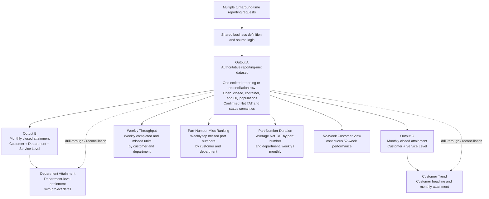

# Designing an Authoritative KPI Data Foundation

*How one reporting-unit dataset created a consistent foundation for multiple dependent operational KPIs*

> **Anonymized portfolio case study.**  
> KPI labels, business wording, field names, and technical details have been
> simplified or generalized. The architecture, scoping decisions, and reasoning
> are unchanged.

---

## 1. The scoping insight

The original request appeared to describe several separate KPIs:

- customer-level target attainment;
- department-level attainment;
- weekly completed and missed units;
- weekly top missed part numbers;
- average turnaround time by part number and work area;
- a 52-week customer performance view.

The weekly part-number miss ranking belongs to a later delivery phase, not the
first. I included it here deliberately: when designing the base layer, I tested
whether one dataset could satisfy the *whole* family of turnaround-dependent
KPIs, not only the current phase. A foundation that only fit the immediate scope
would force a structural change the moment the next KPI arrived.

The published scope matrix is a representative excerpt of the wider scoping
work, so not every dependent KPI described in this architecture case appears as
an individual row there.

The obvious delivery approach would have been to scope and implement each KPI
independently.

I did not treat them as independent.

Before estimating or designing the downstream views, I compared the requests at
the level of business meaning. They all depended on the same underlying
decisions:

- What counts as one reporting unit?
- Which projects belong in the contractual population?
- Which event starts the clock?
- Which event ends the clock?
- Which hold time is deductible?
- What makes a unit closed, open, Hit, Miss, container, or data quality?
- Which completion date assigns a closed unit to a week or month?
- Which rows may enter an attainment rate, average, median, or ranking?

These are not visualization choices. They are the shared semantic contract
behind every dependent KPI.

The scoping decision was therefore to solve that contract once, produce one
authoritative reporting-unit dataset, and make every downstream KPI inherit it.

> **The design question was not “How should each dashboard calculate
> turnaround time?” It was “Where should turnaround time be calculated once so
> that no dashboard has to reinvent it?”**

---

## 2. Why independent KPI implementations would fail

A separate-query approach would appear faster at first:

```text
Department attainment    -> define its own reporting unit and department rate
Weekly throughput        -> define its own weekly completion and miss logic
Part-number miss ranking -> define its own missed-unit and part-number population
Part-number duration     -> define its own average turnaround-time population
52-week customer view    -> define its own weekly customer performance logic
```

But each implementation would need to reproduce the same difficult decisions:

- parent versus child reporting unit;
- receipt anchor and detached-project handling;
- qualifying outbound completion event;
- project-level hold scope;
- open versus closed treatment;
- container and data-quality exclusions;
- population boundaries;
- reporting-period attribution.

That creates predictable failure modes:

1. **Semantic drift**  
   Two KPIs can use different definitions while displaying the same label.

2. **Broken reconciliation**  
   A weekly result and a monthly result may not agree when rolled to the same
   population.

3. **Repeated defects**  
   One source-association or hierarchy defect must be found and corrected in
   several implementations.

4. **Inconsistent exception handling**  
   One query may exclude an ambiguous row while another quietly selects a
   fallback date.

5. **No authoritative answer**  
   When two dashboards disagree for the same project, nobody can explain which
   one reflects the confirmed business rule.

This was not a theoretical concern. Validation surfaced false receipt
associations, unguarded receipt cardinality, a deeper project structure that
could create phantom reporting units, and records showing dispatch without the
required completion timestamp.

A calculation with that level of structural complexity should not be copied
into several downstream queries.

---

## 3. The shared reporting architecture

```text
        Multiple turnaround-time reporting requests
                          |
              Shared business definition
                  and source logic
                          |
        ┌───────────────  OUTPUT A  ───────────────┐
        │   Authoritative reporting-unit dataset    │
        │   open / closed / container / DQ rows     │
        │   confirmed Net TAT and status semantics  │
        └───────┬───────────────────────────┬───────┘
                │                           │
             Output C                    Output B
        Monthly by customer        Monthly by customer,
         and service level         department, service level
                │                           │
                ▼                           ▼
          Customer trend            Department attainment
        (+ Output A detail)         (+ Output A drill-through)

        Output A also serves directly:
          Weekly throughput  ·  Part-number miss ranking
          Part-number duration  ·  52-week customer view
```

*(Rendered view below; the diagram above is the text fallback.)*



### Output A — the authoritative reporting-unit layer

Output A is the only layer that owns the full business logic.

It identifies the reporting unit, applies the governed population rules
(including explicitly documented working treatments pending confirmation),
applies the confirmed endpoint rules, calculates hold-adjusted Net TAT,
classifies the result, and preserves the fields needed for reconciliation and
drill-through.

It contains more than completed performance rows because operational reporting
must also distinguish:

- valid closed units;
- live open units;
- reconciliation-only containers;
- mixed-dispatch or non-unique source exceptions;
- missing or contradictory source evidence.

The distinction is governed in two ways. Structural ambiguity and contradictory
endpoint rows carry NULL metrics, while every non-eligible row also carries an
authoritative status. Downstream consumers use those status and metric-
eligibility rules to keep containers and data-quality rows out of attainment
rates, averages, medians, and rankings.

### Outputs B and C — derived reporting views

Outputs B and C are convenience summaries, not alternative sources of truth.

- **Output B** recomputes monthly closed attainment by customer, department,
  and service level. It is the primary aggregated source for the department-attainment KPI.
- **Output C** recomputes monthly closed attainment overall by customer and
  service level. It is the primary monthly source for the customer-trend KPI.

Both are computed from the same valid unit-level foundation exposed through
Output A. Neither is derived from the other.

That matters because a customer-overall percentage cannot be produced by
averaging department percentages. It must be recalculated from the underlying
Hit and closed-unit counts.

---

## 4. The shared data contract

The foundation is more than a wide dataset. It defines the rules every
dependent KPI must inherit.

| Contract area | Shared rule |
|---|---|
| **Reporting unit** | Use the independently returnable deliverable identified by qualifying dispatch evidence. Downstream KPIs do not reclassify project families. |
| **Population** | Apply the governed contractual population once at the source layer, with any pending working treatment explicitly documented and reversible. Downstream views do not recreate hidden customer or project-status filters. |
| **Start event** | Use the authoritative physical-receipt anchor. Do not substitute data-entry dates or unrelated project dates. |
| **End event** | Use the qualifying outbound packing-list completion event. Project complete or closed status is not an alternative endpoint. |
| **Hold treatment** | Use only the holds recorded against the reporting unit's own project, with the confirmed reason map and defensive interval handling. |
| **Closed result** | Only units with a valid start, one qualifying completed endpoint, and calculable Net TAT become Closed — Hit or Closed — Miss. |
| **Open work** | Open units support live monitoring but do not enter closed attainment. |
| **Containers and DQ** | Keep visible for reconciliation and correction; exclude from normal rates, averages, medians, and rankings through authoritative status and metric-eligibility rules. |
| **Period attribution** | Assign closed results using the authoritative completion date. Weekly and monthly outputs inherit the same event. |
| **Rate aggregation** | Recompute Hit / closed-unit counts at the requested grain. Never average percentages across departments, customers, service levels, weeks, or months. |
| **Duration aggregation** | Calculate averages or medians from valid unit-level Net TAT results. Display completed-unit count as sample-size context. |
| **Empty periods** | The source summary emits no row when a period has no qualifying closed units. If a calendar spine materializes that period, performance remains NULL rather than becoming an artificial 0% result. |
| **Change control** | A change to reporting unit, population, clock, hold treatment, or status is a definition change request—not a dashboard edit. |

These rules act as a data contract between the source-logic layer and every
downstream reporting layer.

---

## 5. Choosing the correct consumption layer

A shared foundation does not mean every visual consumes the same physical
result set.

The correct source depends on the grain of the business question.

| KPI / view | Business question | Consumption path | Why |
|---|---|---|---|
| **Customer trend** | What is monthly customer-level target attainment? | Output C, with Output A for detail | Output C is already at customer + month + service-level grain. |
| **Department attainment** | Which departments are driving monthly attainment, and which jobs Hit or Missed? | Output B, with Output A for drill-through | Output B provides the required department-month summary while Output A preserves unit detail. |
| **Weekly throughput** | How many units were completed, Hit, or Missed each week by customer and department? | Output A aggregated by the authoritative closed-week key | Monthly outputs cannot be safely reversed into weekly results. |
| **Part-number miss ranking** | Which project part numbers produced the most misses each week? | Output A using project part number and closed-week fields | Requires valid closed Miss rows at reporting-unit and project-part-number grain. |
| **Part-number duration** | What is average Net TAT by project part number and department, weekly and monthly? | Output A using unit-level Net TAT and project part number | Supports average, median, and completed-job count without redefining the TAT calculation. |
| **52-week customer view** | What is customer performance across a 52-week weekly view? | Output A aggregated by closed week, customer, and service level | Requires unit-level Hit / closed counts and a complete weekly time spine. The final performance measure and calendar-versus-rolling window remain KPI-specific presentation decisions. |

This is a grain decision, not a duplication of business logic.

A dependent KPI may choose its own aggregation, ranking, time window, or visual
form. It may not redefine the unit, clock, population, hold treatment, or
result.

---

## 6. Minimal source extensions for dependent KPIs

After the v2.0.4 core calculation had been validated, Output A required only
two non-definition-changing source extensions for the wider dependent KPI
family. The dependent KPIs did not require separate turnaround-time
calculations.

They required only two additional source-level dimensions:

- **Project Part Number** — the part number held on the reporting project;
- **Closed Week Start Date** — a Monday-based authoritative week key derived
  from the qualifying completion date and calculated independently of SQL
  Server `DATEFIRST` settings.

The existing monthly completion key remains available for monthly reporting.

With those fields in Output A:

- the weekly-throughput KPI can aggregate weekly completed, Hit, and Missed units;
- the part-number miss-ranking KPI can rank weekly missed project part numbers;
- the part-number duration KPI can calculate average and median Net TAT with completed-job count;
- the 52-week customer-view KPI can build a continuous 52-week customer view.

The dependent KPI logic therefore becomes aggregation logic, not a second
turnaround-time model. The same two fields also cover the later-phase
part-number miss ranking without any further change to the base layer — which
was the point of testing the design against the full KPI family rather than the
current phase alone.

---

## 7. Selected design decisions

The case study includes both confirmed decisions and business rulings that were
still pending at the point of documentation.

### Confirmed design decisions

| Decision | Outcome | Why it matters |
|---|---|---|
| **Reporting unit** | Measure the independently returnable deliverable supported by qualifying outbound evidence. | Prevents parent containers or phantom descendants from distorting the denominator. |
| **Completion endpoint** | Use qualifying outbound packing-list completion. Do not use Project Closed. | Keeps completion tied to the confirmed operational event rather than an administrative status. |
| **Hold deduction** | Deduct only mapped holds recorded against the reporting project, with defensive interval handling. | Prevents unrelated family-level holds from being deducted. |
| **Exception treatment** | Keep container and data-quality rows visible but exclude them from normal metrics. | Preserves reconciliation without contaminating performance results. |
| **Weekly attribution** | Use one Monday-based authoritative closed-week key based on final TAT completion date. | Keeps weekly KPIs aligned across counts, rankings, averages, and 52-week views. |
| **Dependent KPI rule** | Downstream KPIs aggregate Output A and do not reconstruct the TAT calculation. | Creates one controlled semantic source for all dependent views. |

### Architecture alternatives considered and why they were not selected

The detailed rationale appears throughout this case. This table provides the
short decision summary a reader can scan before examining the full design.

| Alternative considered | Decision | Why it was not selected |
|---|---|---|
| **Build each dependent KPI as a separate calculation.** | **Rejected** | Every implementation would have to reproduce reporting-unit, clock, hold, population, and exception logic, creating semantic drift and repeated defects. |
| **Copy the master calculation into several downstream SQL queries.** | **Rejected** | Copying code would create several maintained versions of the same business rule. A controlled fix could be applied to one query and missed in another. |
| **Recalculate Net TAT, holds, or Hit/Miss in the dashboard layer.** | **Rejected** | The visualization layer would become a second calculation engine and could disagree with the confirmed source output. Downstream layers inherit the authoritative result. |
| **Treat Outputs B and C as separate sources of truth, or average department percentages into a customer rate.** | **Rejected** | Both summaries must be recomputed from the same valid unit-level foundation exposed through Output A. Pre-aggregated percentages are not additive and cannot safely be averaged. |
| **Derive weekly KPIs from monthly summary outputs.** | **Rejected** | Monthly grain cannot be reversed into weekly unit populations. Weekly counts, rankings, averages, and 52-week views must aggregate Output A using the authoritative closed-week key. |
| **Let each KPI apply its own internal- or cancelled-project filters.** | **Rejected as an architecture pattern** | The final population ruling is a shared business decision and must be implemented once in Output A, then inherited by every dependent KPI. |
| **Resolve data-quality exceptions through KPI-specific fallback logic.** | **Rejected** | A fallback could make the same ambiguous source row appear differently across views. Exceptions remain visible and excluded until the authoritative evidence is corrected or clarified. |

The selected architecture therefore separates two kinds of freedom:

- dependent KPIs may choose their own grain, aggregation, ranking, time window,
  and presentation;
- they may not redefine the reporting unit, clock, hold treatment, population,
  or result semantics.

### Pending population rulings

| Decision | Working treatment | Architectural impact |
|---|---|---|
| **Internal projects** | Excluded as a reversible working-validation treatment pending customer confirmation. | Changes the included population only. The reporting-unit architecture and downstream dependency model remain unchanged. |
| **Cancelled projects** | Pending: does cancellation remove a unit from the contractual population, or does it remain in scope through to the confirmed return endpoint? | Changes the included population (and possibly status treatment) only. The shared architecture is unchanged. |

These pending items are important business decisions, but they are not
architectural blockers.

Once confirmed, each ruling is recorded in the decision log and implemented
once in Output A. Outputs B/C and all dependent KPIs inherit the result
automatically.

---

## 8. What this changed in the scope

Without the shared foundation, the scope would have been several apparently
small dashboard requests, each carrying hidden definition and validation work.

With the dependency identified, the scope became:

1. Define and validate the master reporting unit and turnaround-time
   calculation.
2. Build Output A as the authoritative operational dataset.
3. Derive standard monthly views from the same valid population.
4. Add only the dimensions and period keys required by dependent KPIs.
5. Keep KPI-specific work focused on the business question:
   - department attainment;
   - weekly completed / Hit / Miss counts;
   - weekly part-number ranking;
   - part-number duration analysis;
   - 52-week customer presentation.
6. Route any shared-rule change back through the foundation rather than
   patching individual dashboards.

This is why several KPI requests became materially easier once the base logic
was solved. The work did not disappear; it moved to the correct level.

> **The reusable asset is not the chart. It is the confirmed reporting-unit
> dataset and the contract that every chart inherits.**

---

## 9. Governance and maintenance

The shared layer also changes how defects and enhancements are managed.

### One controlled fix, inherited everywhere

When validation identifies an implementation defect in the foundation, it is
corrected once. All dependent KPIs inherit the fix at the next refresh.

Examples include:

- source-key normalization;
- valid-receipt cardinality controls;
- evidence-based reporting-unit generation;
- explicit source-data contradiction statuses.

### One business ruling, applied everywhere

A business decision such as the treatment of internal or cancelled projects is
not repeated in each KPI. It is confirmed once, recorded in the decision log,
implemented in Output A, and inherited by Outputs B/C and every dependent view.

### One reconciliation path

When a user challenges a number, the investigation returns to the authoritative
unit row. The team does not compare several separate calculation scripts to
discover which definition each one used.

This reduces maintenance effort, but the more important benefit is trust:
different views can disagree in grain or presentation without disagreeing on
what one reporting unit means.

---

## 10. Outcome

The final design converted a set of apparently separate dashboard requests into
one reusable operational analytics foundation.

The key deliverable was not a single KPI query. It was:

- one authoritative reporting-unit dataset;
- one controlled semantic contract;
- two reusable monthly summary layers;
- a small number of shared dimensions for weekly and part-number analysis;
- a clear boundary between source logic and visualization logic;
- a governed path for future business-rule changes.

The architecture remains valid regardless of the final treatment of internal or
cancelled projects. Those decisions change the population inherited by every
dependent KPI; they do not change the dependency model itself.

> **The scoping value came from recognizing that several requested KPIs were
> not separate calculations. They were different questions asked of the same
> operational fact.**
